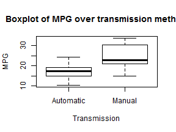
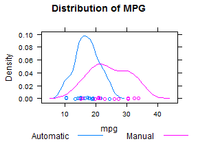
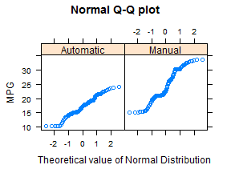
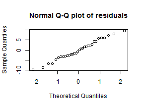

###Executive Summary
The aim of this study is to analyse the mtcars data set within R and answer the following questions raised-

1.Is an automatic or manual transmission better for MPG

2.Quantifying how different is the MPG between automatic and manual transmissions?
Background of data set-The data was extracted from the 1974 Motor Trend US magazine, and comprises fuel consumption and 10 aspects of automobile design and performance for 32 automobiles (1973-74 models).

###Exploratory Data Analysis.

```r
data(mtcars)
str(mtcars)
```

```
## 'data.frame':	32 obs. of  11 variables:
##  $ mpg : num  21 21 22.8 21.4 18.7 18.1 14.3 24.4 22.8 19.2 ...
##  $ cyl : num  6 6 4 6 8 6 8 4 4 6 ...
##  $ disp: num  160 160 108 258 360 ...
##  $ hp  : num  110 110 93 110 175 105 245 62 95 123 ...
##  $ drat: num  3.9 3.9 3.85 3.08 3.15 2.76 3.21 3.69 3.92 3.92 ...
##  $ wt  : num  2.62 2.88 2.32 3.21 3.44 ...
##  $ qsec: num  16.5 17 18.6 19.4 17 ...
##  $ vs  : num  0 0 1 1 0 1 0 1 1 1 ...
##  $ am  : num  1 1 1 0 0 0 0 0 0 0 ...
##  $ gear: num  4 4 4 3 3 3 3 4 4 4 ...
##  $ carb: num  4 4 1 1 2 1 4 2 2 4 ...
```

There are 11 variables, since we are interested in the relationshp between mpg and other variables, we first check the correlation between mpg and other variables by using the cor() function


```r
cor(mtcars$mpg,mtcars[,-1])
```

```
##          cyl    disp      hp   drat      wt   qsec    vs     am   gear
## [1,] -0.8522 -0.8476 -0.7762 0.6812 -0.8677 0.4187 0.664 0.5998 0.4803
##         carb
## [1,] -0.5509
```
From the correlation data, we could see cyl, hp, wt and carb are negatively correlated with mpg.

###1.Is an automatic or manual transmission better for MPG

```r
mtcars$am <- as.factor(mtcars$am)
levels(mtcars$am) <-c("Automatic", "Manual")
```

A boxplot was created to examine the relationship between mpg and am type (Appendix 1) and it seems that automatic cars have better mpg compared to manual cars.
(Figure1)

To perform a statistical analysis to support this hypothesis, we use t-test

```r
t.test(mtcars$mpg~mtcars$am,conf.level=0.95)
```

```
## 
## 	Welch Two Sample t-test
## 
## data:  mtcars$mpg by mtcars$am
## t = -3.767, df = 18.33, p-value = 0.001374
## alternative hypothesis: true difference in means is not equal to 0
## 95 percent confidence interval:
##  -11.28  -3.21
## sample estimates:
## mean in group Automatic    mean in group Manual 
##                   17.15                   24.39
```

The p-value is 0.001374, we may think it is ok to reject the null hypothesis and conclude automatic has low mpg compared with manual cars - however this assumption is based on all other characteristics of auto cars and manual cars are same (e.g: auto cars and manual cars have same weight distribution) - which needs to be further explored in the multiple linear regression analysis.

We will compare the distribution of mpg variable between automatic and manual transmission through density plot To assess the difference between mean mpg of automatic and manual transmission we will perform linear regression with mpg as dependent variable and the am as independent variable. But before performing the regression we will also produce Normal Q-Q plot to see whether the mpg follows normal distribution or not. Finally after performing linear regression we will analyze residuals for diagnostic purposes.

### 3. Quantifying how different is the MPG between automatic and manual transmissions?

Finally, we will calculate or quantify difference between MPG and Automatic and Manual transmission To calculate the difference we will use simple linear regression with mpg as the dependent variable and am as independent variable In this model we will use the intercept because the am variable could NOT be the only factor to determine mpg.

###Results
The box-whisker plot of mpg over transmission mechanism shows that the median mpg is lower in automatic transmission compared to its manual counterpart. Also from the plot we see that the variation in mpg in manual transmission is larger than automatic transmission. The first quartile of manual transmission is higher than the 3rd quartile of automatic transmission. The result clearly indicates both groups have a very different mpg average.

*See Figure 1 in Appendix

To compare the pattern of distribution of mpg over transmission we produced a density plot, it seems that there is some overlap in mpg between automatic and manual transmission but the peak is very different. Also the variation of individual mpg is different between two groups. Overall the pattern looks like a normal distribution though there is minor indication of two peaks in the manual transmission data. Next we produced a Normal Q-Q plot to see if the data follows normality.

*See Figure 2 in Appendix

The normal Q-Q plot is expected to be a straight line along the diagonal and this indicates normality. In our case the data shows a similar pattern with very minor deviation from the diagonal line. However, we could apply standard method to compare means between groups.

*See Figure 3 in Appendix

Next, a linear regression is performed to assess whether there is any difference in the average mpg between groups.


```r
cardata <- mtcars
cardata_sub <- cardata[c("am","mpg")]
lm_mpg <- lm(mpg~am,data=cardata_sub)
coef(summary(lm_mpg))
```

```
##             Estimate Std. Error t value  Pr(>|t|)
## (Intercept)   17.147      1.125  15.247 1.134e-15
## amManual       7.245      1.764   4.106 2.850e-04
```
95% confidence interval of the difference is represented by the confidence interval of the am variable


```r
confint(lm_mpg)
```

```
##              2.5 % 97.5 %
## (Intercept) 14.851  19.44
## amManual     3.642  10.85
```

The results are as follows:
Variable Coefficient 95% CI AM 7.24* (3.64, 10.85)
*p-value is less than 0.001
The regression coefficient indicates that the average mpg for manual transmission is 7.24 units higher compared to automatic transmissions. The confidence interval and the p-value indicate that the difference in mpg between groups is statistically different from zero.
The residual analysis shows that it follows normal distribution.
*See Figure 4 in Appendix


##Appendix


####Figure 1
Boxplot is the compare summary statistics between two group (automatic vs manual) transmission


```r
cardata <- mtcars
cardata_sub <- cardata[c("am","mpg")]
boxplot(cardata_sub$mpg~factor(cardata_sub$am,label=c("Automatic","Manual")),
        main="Boxplot of MPG over transmission method",xlab="Transmission",ylab="MPG")
```

 

####Figure 2
The density plot is the see the shape of distribution in both group

```r
library(lattice)
densityplot(~mpg,group=factor(am,label=c("Automatic","Manual")),
 data=cardata_sub,auto.key=list(space = "bottom",columns=2),
 main="Distribution of MPG")
```

 


####Figure 3
Q-Q Normal plot is the see if it follows normal distribution

```r
qqmath(~mpg|factor(am,label=c("Automatic","Manual")),data=cardata_sub,f.value=ppoints(100),
main="Normal Q-Q plot",xlab="Theoretical value of Normal Distribution",ylab="MPG")
```

 


```r
est_mpg <- predict(lm_mpg,newdata=cardata_sub,type="response")
lm_res <- cardata$mpg-est_mpg
```

####Figure 4

Normal QQ plot of residuals


```r
qqnorm(lm_res,main="Normal Q-Q plot of residuals")
```

 

